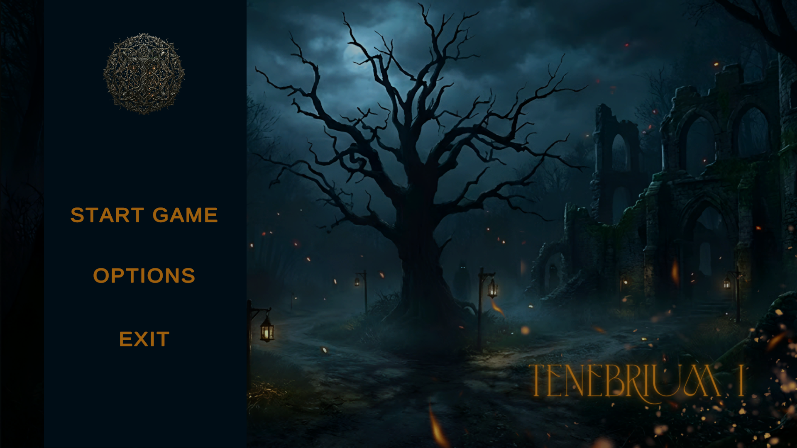
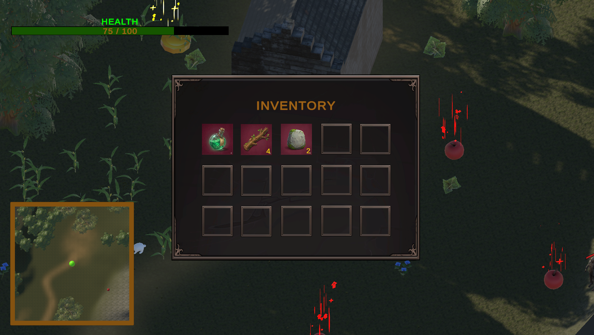
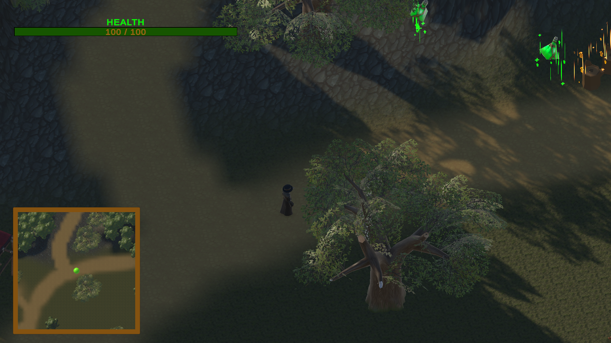
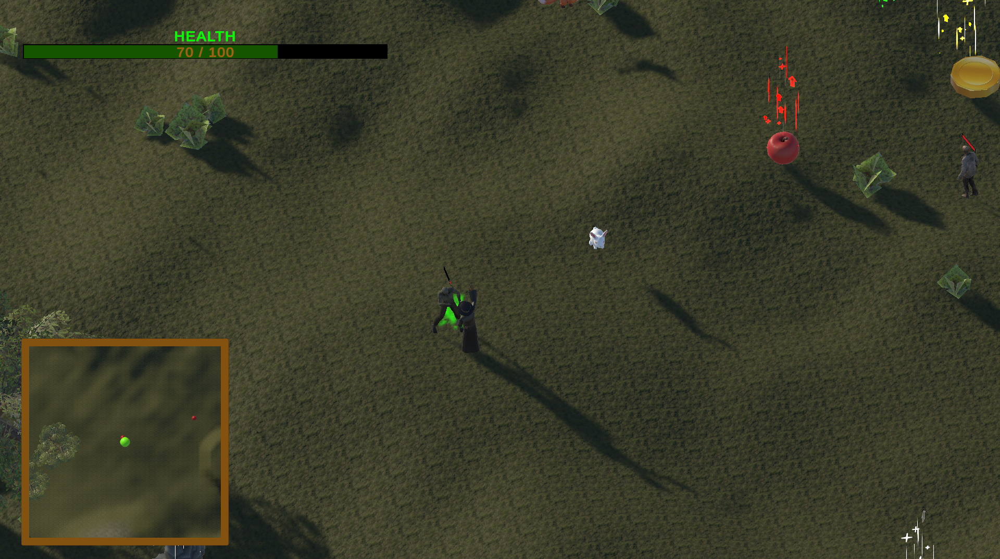
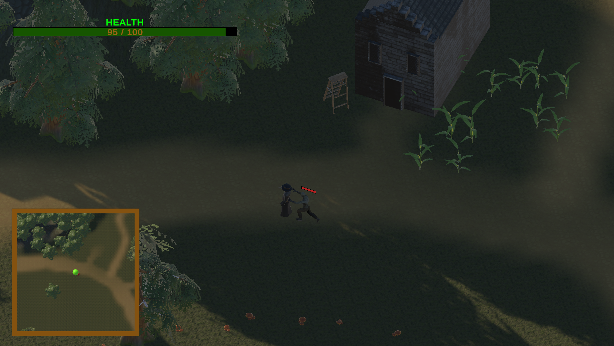

<h1 align="center">Tenebrium</h1>

  <strong>Isometric survival RTS developed in Unity with C#</strong> 
  A real-time gameplay prototype focused on exploration, resource gathering, inventory management and zombie combat

  
  
  

  <strong>Author:</strong> Aris-Georgian ILIE

---

## TABLE OF CONTENTS

- [ABOUT THE PROJECT](#about-the-project)
- [GAME CONCEPT](#game-concept)
- [MAIN GAMEPLAY LOOP](#main-gameplay-loop)
- [CORE FEATURES](#core-features)
- [GAME SYSTEMS IN DETAIL](#game-systems-in-detail)
  - [Player Control and Movement](#player-control-and-movement)
  - [Interaction and Resource Gathering](#interaction-and-resource-gathering)
  - [Inventory System](#inventory-system)
  - [Combat System](#combat-system)
  - [Enemy AI](#enemy-ai)
  - [Map, Minimap and Fog of War](#map-minimap-and-fog-of-war)
  - [Procedural World Population](#procedural-world-population)
  - [UI, Menus and Feedback](#ui-menus-and-feedback)
- [SCREENSHOTS](#screenshots)
- [CONTROLS](#controls)
- [TECHNICAL ARCHITECTURE](#technical-architecture)
- [SCRIPT BREAKDOWN](#script-breakdown)
- [TECHNOLOGIES USED](#technologies-used)
---

## ABOUT THE PROJECT

<strong>Tenebrium</strong> is an isometric survival RTS prototype created in <strong>Unity using C#</strong>. The project was designed as a complete real-time gameplay experience that combines movement, exploration, interaction, resource collection, inventory management and enemy encounters inside a dark fantasy environment.

The player controls a survivor on a 3D terrain viewed from an isometric perspective. Rather than using direct keyboard character control, the game uses a point-and-click approach that fits the strategy and survival direction of the project. This makes the gameplay readable, structured and easy to understand while also leaving room for tactical movement and world interaction.

At its core, the game is built around a continuous loop: the player explores the environment, gathers useful items, avoids danger, engages hostile zombies and tries to survive long enough to progress through the map. The world is not static. Resources and enemies populate the terrain, explored zones become visible through fog of war and hostile creatures react dynamically when the player gets close.

A distinctive aspect of <strong>Tenebrium</strong> is that combat is not presented as pure destruction. Instead of only damaging enemies in a traditional way, the player uses a cure-based projectile mechanic that reduces the infection level of zombies. Once a zombie is fully cured, it is transformed into a human survivor. This gives the combat system its own identity and makes the gameplay feel more original than a simple attack-and-eliminate structure.

The project was also developed as a technical exercise in building modular Unity systems that work together as part of one playable game. Movement, interaction, inventory, AI, procedural spawning, UI, menus and feedback systems are all connected to support a single cohesive experience.

---

## GAME CONCEPT

The idea behind <strong>Tenebrium</strong> is to create a survival-oriented isometric game where the player is constantly balancing movement, collection and threat management.

The game places the player in a dark environment populated by resources and zombies. The terrain invites exploration, but exploration is not safe. To move forward, the player must collect items from the world, organize them properly in the inventory and remain aware of surrounding enemies. This creates a natural tension between curiosity and caution.

The game also aims to make each part of the player experience feel connected. Resource gathering is not included just for decoration. It matters because collected items support survival. Inventory management is not included only as a UI feature. It matters because item organization and consumption directly affect how long the player can survive. Enemy AI is not only there to make the world feel active. It matters because it changes the player's decisions while moving through the map.

The result is a project that tries to blend several gameplay pillars into one structure.

- exploration
- collection
- risk management
- real-time combat
- interface-based survival support

---

## MAIN GAMEPLAY LOOP

The main gameplay loop in <strong>Tenebrium</strong> can be understood in a few connected stages.

First, the player enters the world and begins exploring the terrain. Because the camera is isometric and the map includes fog of war, the player does not immediately have full knowledge of the environment. This creates a sense of progression through discovery.

While moving through the terrain, the player encounters resource nodes and collectible objects. These can be approached and collected through the interaction system. Once collected, they are stored in the inventory, where they can be kept, rearranged or used if they are consumables.

At the same time, zombies inhabit the map and create pressure on the player. Some enemies may be wandering or idle at first, but once the player gets too close, they begin chasing and attacking. The player must then decide whether to avoid them, reposition or engage in combat.

Combat happens in real time and relies on target selection and projectile-based attacks. Instead of a classic weapon system that only lowers health, the player uses a cure mechanic that lowers the infection level of zombies. This changes the tone of combat and gives the game a stronger thematic identity.

This loop repeats continuously.

1. move through the terrain  
2. reveal new space  
3. collect useful items  
4. manage inventory  
5. react to enemy threats  
6. survive through movement, healing and combat  

Because these systems feed into each other, the game feels structured and complete even as a prototype.

---

## CORE FEATURES

### Real-time isometric exploration

The game is played from an isometric perspective on a 3D terrain. This gives the project the look and readability of a strategy or survival title while keeping interaction simple and clear.

### Point-and-click player movement

The player moves by selecting destinations on the ground. Unity NavMesh is used to calculate reliable paths across the map, which makes movement smooth and suitable for a real-time RTS-style experience.

### Resource gathering

The environment contains interactable objects that can be collected by the player. Gathering is tied to distance checks, interaction logic and inventory updates.

### Inventory with drag and drop

Collected items are stored in an inventory interface that supports item stacking, movement between slots and direct item use for consumables.

### Zombie encounters

Hostile zombies move in the world and react to player presence. They can patrol, detect, chase and attack, which keeps exploration tense and dynamic.

### Cure-based combat

The player does not simply destroy enemies. Zombies are attacked using a projectile that reduces their infection level. Once fully cured, they transform into human survivors.

### Map support systems

The project includes a minimap, a fullscreen map and fog of war. These systems help the player understand the environment while preserving the feeling of progressive discovery.

### Procedural placement

Resources, animals and enemies can be spawned procedurally according to terrain-based conditions. This helps the environment feel more alive and less manually staged.

### Survival-oriented interface

The user interface includes health tracking, inventory access, map controls, menu settings and game over feedback to support the full gameplay loop.

---

## GAME SYSTEMS IN DETAIL

### Player Control and Movement

Player movement is one of the most important systems in the game because it defines how the user experiences the world.

The character is controlled through mouse input. When the player clicks on a valid terrain position, the unit moves to that point using a <strong>NavMeshAgent</strong>. This means the character is not just moving in a straight line, but following a path that respects walkable surfaces and terrain navigation rules.

This approach works especially well for an isometric survival RTS because it gives the player a clear and controlled way to move while keeping the focus on planning and observation. It also makes the transition between exploration, gathering and combat feel natural, since all three are built on the same movement logic.

Movement is also supported by animation and sound. The player's character blends between idle and movement states and footstep sounds are triggered in a way that helps the movement feel responsive. This is a small detail technically, but it is important for presentation because it makes the game feel much more alive.

---

### Interaction and Resource Gathering

The world contains objects that are not just background decoration. Many of them are meant to be approached and interacted with by the player.

The interaction system handles how the player selects a nearby object, moves within the necessary distance and then triggers the collection action. Once the interaction is complete, the item is transferred into the inventory and the object is removed from the scene.

This system is important because it turns gathering into a real mechanic rather than an automatic pickup. The player must intentionally approach the object, which reinforces the connection between movement, world awareness and item collection.

From a design perspective, gathering serves more than one purpose. It encourages exploration, supports inventory usage and gives the player tools to survive longer. It also helps make the map feel meaningful, because the environment becomes a place of opportunity as well as danger.

---

### Inventory System

The inventory system acts as the bridge between exploration and survival.

When the player gathers objects from the environment, they are stored in an inventory UI. This interface supports stacking, which means similar items can be grouped together up to a defined limit. This keeps the system practical and organized.

Items can also be moved between slots using drag and drop. If the destination slot is already occupied, the system can handle slot swapping. This is useful because it allows the player to manage resources in a deliberate and intuitive way.

Consumable items are especially important because they affect survival directly. These can be used from the inventory to restore health, which means the inventory is not just a place to store data, but a meaningful gameplay tool that influences player decisions in dangerous moments.

The goal of this system is to make collected resources feel valuable and usable. Instead of simply counting pickups in the background, the project gives them a visible and interactive role inside the UI.

---

### Combat System

Combat in <strong>Tenebrium</strong> is designed to be understandable in real time while also giving the game a unique identity.

When the player targets a zombie, a projectile-based cure attack can be launched. The projectile travels toward the enemy and, on impact, reduces its infection level. This is the core combat mechanic and it differs from the more common approach of simple damage-based elimination.

Once the infection value reaches zero, the zombie is no longer treated as an active enemy and is transformed into a human survivor. This mechanic creates a clear thematic direction for the game and adds more interest to the technical implementation. The system is not just removing enemies, but actively changing their state and replacing their role in the scene.

The combat flow also benefits from sound feedback, hit response and enemy health or infection display. These details help the player understand whether the action was successful and how close the target is to being cured.

By making the combat system revolve around curing rather than only destroying, the project becomes more memorable and technically richer.

---

### Enemy AI

Enemy behavior in <strong>Tenebrium</strong> is built around a simple but reliable AI structure.

Zombies move through a sequence of states such as idle, patrol, chase and attack. When the player is far away, a zombie may remain passive or wander in the environment. Once the player enters its detection range, the zombie shifts to active pursuit. When close enough, it begins attacking.

This state-based approach makes enemy behavior easier to control and easier to read in gameplay. It also supports future expansion, because additional states or reactions could be introduced later without redesigning the whole system.

Technically, this AI is implemented through animator state machine behaviors and movement logic based on Unity NavMesh. That combination allows enemies to appear responsive while still remaining manageable from a scripting point of view.

The result is that zombies do not feel static or scripted in a narrow way. They react to the player's position and movement, which makes the world feel more active and dangerous.

---

### Map, Minimap and Fog of War

Exploration becomes much more interesting when the player is not given full information immediately.

To support that idea, the project includes a <strong>fog of war</strong> system that reveals areas around the player over time. This means the world feels gradually discovered rather than instantly visible. It also helps reinforce movement as a meaningful part of gameplay.

The game also includes both a <strong>minimap</strong> and a <strong>fullscreen map</strong>. The minimap provides quick awareness during normal play, while the larger map offers a broader understanding of the explored terrain and surrounding space.

These systems are important because they support orientation and planning without removing uncertainty. The player has tools to understand the environment, but still needs to move through it actively to reveal more.

This balance helps the game feel more survival-oriented and less like a completely known strategy map.

---

### Procedural World Population

The project supports the procedural placement of resources, enemies and ambient creatures.

This does not mean that objects are simply scattered randomly everywhere. Instead, placement can be filtered through terrain-based conditions such as slope limits, altitude ranges and walkable areas. This helps keep the generated results playable and believable.

Procedural placement is useful because it adds variation to the world and helps the map feel less repetitive. It also demonstrates how gameplay objects can be introduced into the environment while still respecting practical rules for balance and navigation.

For a project like this, procedural population is a good way to combine technical control with natural-looking map distribution.

---

### UI, Menus and Feedback

A prototype feels much more complete when important systems are supported by a functional interface.

For that reason, <strong>Tenebrium</strong> includes several UI elements beyond the main gameplay view. These include the health interface, inventory access, minimap and fullscreen map controls, game over feedback, menu navigation, options and saved preferences.

The main menu provides entry into the game and access to settings. Preferences such as audio values can be stored and loaded through <code>PlayerPrefs</code>, which helps the project feel more polished and user-friendly.

Visual and audio feedback also play an important role. Sounds for movement, collection, combat and enemy interaction help the player understand what is happening. UI updates make item collection and health changes immediately visible. These details strengthen the connection between mechanics and player understanding.

---

## SCREENSHOTS

### Main Menu

  

The main menu introduces the game and provides access to the playable session and settings. It is part of what makes the project feel like a complete prototype rather than a technical test scene.

### Inventory Interface

  

The inventory interface shows how collected items are stored and managed. It supports stack handling, slot-based organization and direct use of consumables.

### Map and Exploration

  

The map view works together with the minimap and fog of war systems to help the player navigate the terrain and understand explored areas.

### In-Game Combat View

  

This screenshot shows the active gameplay view, including the atmosphere, isometric perspective, environmental layout and combat context.

### Zombie Encounter

  

The zombie scene highlights the hostile side of the world and the enemy presence that drives the survival tension throughout the game.

---

## CONTROLS

| Action | Input |
|---|---|
| Move player | Left Click |
| Interact with objects or attack enemies | Right Click |
| Open or close inventory | `I` |
| Consume hovered consumable item | `E` |
| Toggle map mode | `M` |
| Return to the menu | `Ctrl + H` |

---

## TECHNICAL ARCHITECTURE

The project is organized around modular gameplay systems that communicate with each other in a structured way.

The <strong>player control layer</strong> manages movement, animation updates and interaction input.

The <strong>interaction layer</strong> determines what objects or enemies the player can act upon and under what conditions an action is allowed.

The <strong>inventory layer</strong> stores collected items, displays them in the UI and allows reorganization or consumption of item instances.

The <strong>enemy layer</strong> manages zombie state, pursuit logic, combat reactions and cure transformation.

The <strong>world systems layer</strong> handles spawning, environmental population, fog of war and map behavior.

The <strong>UI and menu layer</strong> presents health, inventory, map information, settings and game over flow.

This separation helps the project remain readable and expandable. It also makes the codebase easier to maintain because major responsibilities are grouped into clear modules instead of being concentrated into a few oversized scripts.

---

## SCRIPT BREAKDOWN

### Core gameplay scripts

- `PlayerController.cs`  
  Handles point-and-click movement, NavMesh pathfinding, animation parameter updates and footstep sound timing.

- `PlayerInteraction.cs`  
  Detects right-click actions and determines whether the player is interacting with an object or targeting an enemy.

- `PlayerState.cs`  
  Manages player health, healing, damage intake, UI updates and game over behavior.

- `CurePotion.cs`  
  Controls the projectile that travels toward enemies and applies the cure effect when contact happens.

### Inventory system scripts

- `InventorySystem.cs`  
  Main inventory manager responsible for adding items, handling slots and opening or closing the inventory interface.

- `InventoryItem.cs`  
  Defines item data, stack limits, consumable behavior and item-specific UI information.

- `ItemSlot.cs`  
  Manages how items are placed inside inventory slots, including swaps and movement logic.

- `DragDrop.cs`  
  Provides drag and drop support for moving inventory items in the UI.

### Enemy system scripts

- `EnemyManager.cs`  
  Stores enemy-related values such as infection, sound logic and transformation into survivors.

- `ZIdleState.cs`  
  Controls passive enemy behavior while waiting or observing for the player.

- `ZWalkState.cs`  
  Handles patrol or roaming logic on valid terrain.

- `ZChaseState.cs`  
  Switches enemy behavior into pursuit mode after player detection.

- `ZAttackState.cs`  
  Manages close-range enemy attacks and repeated damage timing.

### World and environment scripts

- `AdvancedResourceSpawner.cs`  
  Spawns resources using terrain-aware rules.

- `EnemySpawner.cs`  
  Places enemies across the terrain in a controlled and playable way.

- `AnimalSpawner.cs`  
  Adds ambient creatures to improve the world atmosphere.

- `FogOfWar.cs`  
  Reveals visible areas around the player and supports progressive exploration.

- `MapController.cs`  
  Manages map toggling and switching between minimap and expanded map views.

- `MinimapFollow.cs`  
  Keeps map tracking synchronized with the player's position.

### Menu and utility scripts

- `Menu_Controller.cs`  
  Handles main menu logic, options and some settings management.

- `LoadPrefs.cs`  
  Loads saved preference values when the game starts.

- `GameOverManager.cs`  
  Controls defeat flow and return-to-menu behavior.

- `CameraFacingBillboard.cs`  
  Rotates world-space elements so they remain readable relative to the camera.

- `MysticalFloater.cs`  
  Adds simple floating or hovering movement to objects for visual polish.

---

## TECHNOLOGIES USED

| Technology | Role in the project |
|---|---|
| **Unity** | Main engine used to build the entire game |
| **C#** | Core language used for gameplay programming |
| **Unity NavMesh** | Navigation system for player and enemy movement |
| **NavMeshAgent** | Real-time pathfinding across the terrain |
| **Unity Animator** | Animation control for player and enemies |
| **State Machine Behaviours** | Structured enemy AI state logic |
| **Unity UI** | Health bar, inventory, menus, minimap and map interface |
| **TextMeshPro** | Clean and readable UI text rendering |
| **PlayerPrefs** | Saving and loading user settings |
| **AudioSource / AudioClip** | Sound playback for movement, collection and combat feedback |
| **Physics Raycasting** | Detecting clicks, world targets and interaction points |
| **Layer Masks** | Separating valid terrain, enemies and interactable objects |
